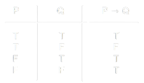

## Conseguenza Semantica

!!! abstract "Definizione ― Conseguenza Semantica"
	Per ogni modello $m$, se $m$ soddisfa $A_1,A_2,\dots,A_n$, allora $m$ soddisfa $B$.

	$$
    \begin{array}{c}
        A_1,A_2,\dots,A_n \models B
    \end{array}
	$$

	Si diche anche che $B$ consegue semanticamente da $A_1,A_2,\dots,A_n$

??? note "Note aggiuntive"
	- Quando $n = 0$, quindi quando non ci sono premesse alla conseguenza semantica, allora per ogni $m$, $m$ soddisfa $B$.

	$$
    \begin{array}{c}
        \models B \\
        \\
        B \text{ è una Proposizione Valida o Tautologia}
    \end{array}
	$$

??? example "Esempio"
	- Considerato l'insieme $\mathbb{N}$ a questo corrisponderà una qualche Algebra di Boole.

	<figure markdown="1">
	
	</figure>

	- Ora prendiamo come esempio l'elemento $9$:

	<figure markdown="1">
	
	</figure>

	- Possiamo affermare che:

	$$
	    \begin{array}{c}
	        9 \in Q \\
	        9 \not\in P \\
	        \\
	        m(Q) = T \\
	        m(P) = F
	    \end{array}
	$$

	- Una volta individuati $P$ e $Q$, possiamo individuare l'interpretazione delle restanti proposizioni ($P \mathop{\vee} Q$ e $P \mathop{\wedge} Q$) attraverso le Tabelle di Verità.

	|  |  |
	|:-----------------------:|:----------------------:|

	$$
	    \begin{array}{c}
	        P \mathop{\vee} Q \rightarrow T \\
	        P \mathop{\wedge} Q \rightarrow F
	    \end{array}
	$$

	- Il fatto che $m(Q)$ sia True, in logica si dice che **$Q$ è vero in $m$** oppure **$m$ soddisfa $Q$**, usando la seguente notazione:

	$$
	    \begin{array}{c}
	        \models_m Q
	    \end{array}
	$$

	- Quindi: il modello $m$ assegna True come valore di verità al predicato $P$.

## Implicazione

!!! abstract "Definizione ― Implicazione"
	L'Implicazione è un legame tra proposizioni che mette in relazione i valori di verità di due proposizioni matematiche, dette antecedente e conseguente.

	Se $P$ e $Q$ sono due enunciati, compondendoli col connettivo logico di implicazione materiale si ottiene l'enunciato composto:

	$$
	    \begin{array}{c}
	        P \rightarrow Q
	    \end{array}
	$$

<figure markdown="1">
  
  <figcaption>Tavola di Verità dell'Implicazione</figcaption>
</figure>

??? example "Esempio"
	- Dati due enunciati $P$ = piove e $Q$ = la strada è bagnata, unendole con il connettivo logico di implicazione materiale si ottiene la proposizione composta:

	$$
		\begin{array}{c}
		    P \rightarrow B: \text{ se piove allora la strada è bagnata}
		\end{array}
	$$

	- Se si verifica la causa $P$ (piove) allora segue l'effetto $Q$ (la strada è bagnata).
	- Se $P$ e $Q$ sono proposizioni vere, allora è vero anche l'enunciato $P \rightarrow Q$, e ciò giustifica la prima riga della Tavola di Verità.
	- Se la prima proposizione $P$ è vera e la seconda $Q$ è falsa, l'implicazione è falsa, perchè quando si verifica la causa (piove) deve necessariamente verificarsi l'effetto (la strada è bagnata).
	- Infine, nel caso in cui la causa $P$ sia falsa, nulla si può dire sull'effetto $Q$: infati la strada potrebbe essere bagnata per altri motivi (notte di umidità). 